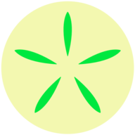

# drawgon

A easy to use web-hosted vector/raster drawing program.  The goal is to
create fun procedural SVGs that can be easily exported to the Axidraw,
to pair with physical art production.

Checkout the hosted version here:

[kamalasaurus.github.io/drawgon](https://kamalasaurus.github.io/drawgon)

### Credits

drawgon logo by [holistudio](https://github.com/holistudio)\
drawgon logo color inspiration by [ltejedor](https://github.com/ltejedor)

### License

Open Software License ("OSL") v 3.0\
Copyright (c) 2019 kamalasaurus

